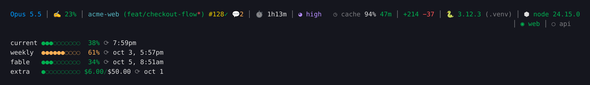
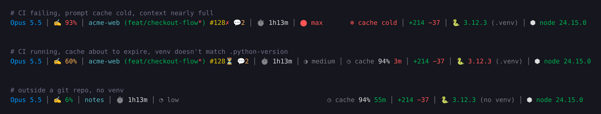

# claude-code-statusline

A two-part status line for Claude Code: session info on top, plan usage below.



Colors follow state: CI failing or running, cache cold or about to expire, a venv that doesn't
match `.python-version`, context close to full.



- **Line 1**: model, context used, dir + branch (`*` = dirty), PR number + CI (`✓ ✗ ⏳`), unresolved
  Codex threads, session time, effort level. Right side: prompt-cache hit rate and time left,
  lines added/removed, Python venv and Node version (red when they don't match the repo's
  `.python-version` / `.node-version`).
- **Line 2** (optional): dev servers listening or not, from `STATUSLINE_DEV_PORTS`.
- **Usage**: 5-hour and weekly limits, per-model weekly caps (e.g. Fable), extra-usage credits.

Anything that hits the network (`gh`, the usage API) runs in a detached background job and
is cached under `$TMPDIR/claude`, so a render never waits on it.

## Install

```bash
git clone <this repo> ~/claude-code-statusline
cd ~/claude-code-statusline
./install.sh
```

The installer copies `statusline.sh` to `${CLAUDE_CONFIG_DIR:-~/.claude}/statusline.sh`, sets
`statusLine` in `settings.json` (backup saved as `settings.json.bak-statusline`), and creates
`~/.config/claude-statusline/config.sh` if it doesn't exist. Re-run it after a `git pull`.

Required: `bash`, `jq`, `git`, `curl`. Optional: `gh` (PR + CI), `ss` or `lsof` (dev ports).

## Configure

Edit `~/.config/claude-statusline/config.sh`:

```bash
STATUSLINE_DEV_PORTS="web:3000 api:8000"   # name:port pairs for line 2
STATUSLINE_DEV_PORTS_WHEN="apps/web apps/api"  # only in repos that have one of these
```

The Codex badge (`💬N`) only appears in repos that ship
`.claude/skills/codex-lens/scripts/codex-threads.sh`; elsewhere it stays off.

## Platform notes

Built and used on Linux. On macOS it falls back to `lsof`, `stty -f` and the Keychain for the
OAuth token; right-alignment needs GNU `wc -L`, so without coreutils the right side is joined
with `│` instead.

## Uninstall

Restore `settings.json.bak-statusline`, or delete the `statusLine` key from `settings.json`,
then remove `statusline.sh` and `~/.config/claude-statusline/`.

## Contributing

See [CONTRIBUTING.md](CONTRIBUTING.md). Screenshots are generated by `demo/render.sh` from fake
data; re-run it when the output changes.

## License

[MIT](LICENSE)
